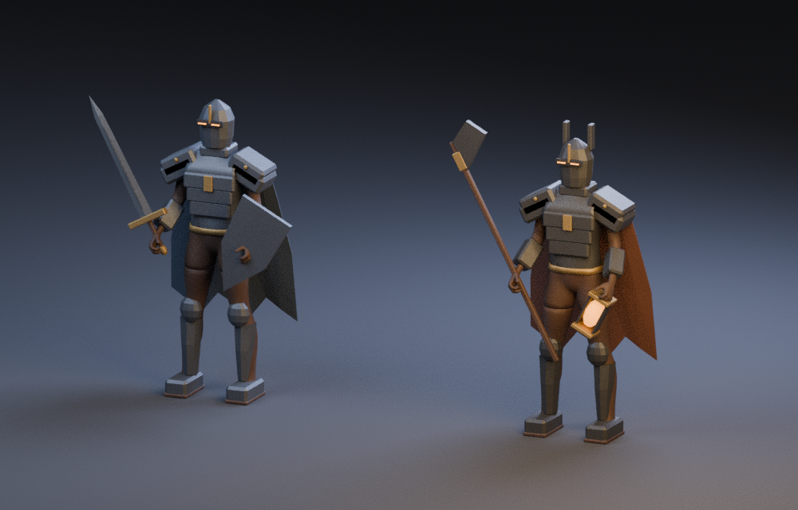
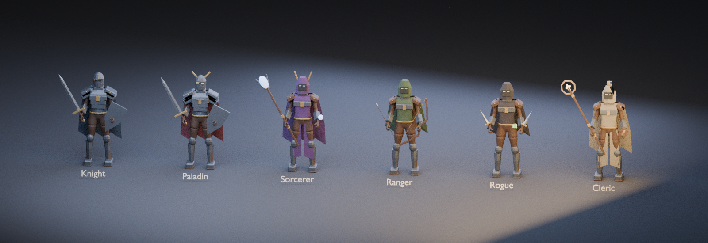
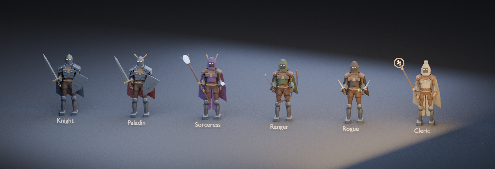
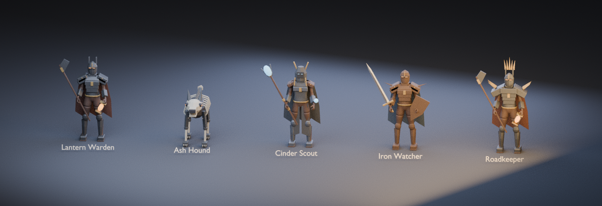

# Ashlight: mobile 3D combat starter

An original combat prototype inspired by reactive turn-based RPGs. All six hero classes now use stylized dark fantasy armor and a generated ruined courtyard. Chapter one and the paired late-chapter bosses use enemy models; other encounters still use placeholder enemies. No Clair Obscur assets, names, music, or story are included.

## Open and play

1. Install Unity Hub and Unity **6000.0.65f1** with **Web Build Support (WebGL)** for browser testing on iPhone from Windows. Android Build Support is optional for Android APKs.
2. Open this `MobileGame` directory as a Unity project. Allow package import to finish.
3. The editor helper creates `Assets/Scenes/Battle.unity` and registers it for builds. If necessary select **Ashlight > Prepare Mobile Project**. Open that scene, then press Play.
4. The game opens on the **Chapters** menu. Select the unlocked chapter, then use **Attack**, then watch **GET READY** followed by **PARRY OR DODGE!**. The shrinking defense meter is yellow during the 180 ms parry window, then blue for the remaining dodge window (400 ms total). Defense registers on button press, not release. Restart resets the battle. Mouse clicks work in the editor; buttons accept touch on devices.

The combat presentation includes health bars, attack lunges, enemy windup, dodge motion, and parry/counter feedback. Rowan and the Lantern Warden now use armored models with basic combat animation; other enemies still use placeholder capsules. Safe-area bounds update when the window or phone orientation changes. New presentation and touch-down behavior require Unity/device validation.

The scene starts empty intentionally: `Prototype` generates the camera, lighting, arena, characters, event system, and HUD at runtime. Use the built-in rendering pipeline. The UI uses the legacy input module; keep Active Input Handling set to **Input Manager (Old)** or **Both**. Landscape orientation and safe-area bounds are configured for the prototype. Device cutouts, aspect ratios, timing feel, and actual rendering need device testing.

## Stylized dark fantasy reference

Rowan (Common Knight) and the first enemy, Lantern Warden, wear original angular armor, closed helmets, tattered capes, and muted metal. The Warden carries a halberd and glowing lantern. A torchlit ruined courtyard, lower camera, staggered party positions, charcoal HUD and compact health bars establish the new direction. All six hero classes now have male and female dark fantasy variants. All five chapter-one enemies and the paired bosses from chapter three onward now have modeled visuals; other enemies remain placeholder capsules. The built-in rendering pipeline is retained.

To update an existing Unity project:

1. Copy **Assets/Art**, the updated **Assets/Editor** and **Assets/Scripts** from this version. Keep your existing project settings and saves.
2. Wait for importing, then run **Ashlight > Prepare Mobile Project**.
3. Run **Ashlight > Art > Build Dark Fantasy Roster** to refresh all twelve class/gender models. Use **Build Dark Fantasy Reference** only if Rowan or the Warden also need refreshing. Automatic preparation preserves existing generated prefabs.
4. Open the Battle scene and press Play. Select Rowan in your party and start the first chapter. If you already completed the campaign, use **Restart Campaign** to replay it while preserving your collection and currency.



The class roster uses the existing hero gender assignments (18 women and 12 men). Paladins wear winged helmets and wine-colored capes; Sorceress/Sorcerer carry crystal staves and crowned cowls; Rangers carry recurve bows, arrows and quivers; Rogues carry twin leaf daggers and poison vials; Clerics carry halo staves, prayer books and ash-colored split vestments. Knights retain the sword and kite shield. Classes share basic armor construction; individual named heroes do not yet have unique art or rarity-specific outfits.




Named hero prefabs still take priority. Otherwise, hero loading now uses `Resources/Heroes/DarkFantasy/<class>_<gender>`, then the legacy class/gender prefab as fallback. The new generated folder preserves existing custom and legacy prefabs. Characters still use basic animation; Ranger and Rogue attacks and caster staff motions have distinct poses.

These are Blender character art previews, not Unity screenshots; they do not show the courtyard or HUD. The free CC0 source and original asset details are in [DarkFantasy/CREDITS.md](Assets/Art/DarkFantasy/CREDITS.md).

Validation: **2,100 combat checks passed**. The twelve new class FBX files independently reimported with weighted meshes, UVs, the 53-bone skeleton and seven animation states; each is below 18,000 triangles and uses at most seven material slots. All three textures are 512×512 and their checksums match. Unity is unavailable in this environment, so Unity compilation, import, Play mode, clipping, camera framing and mobile performance require local verification.

## Enemy art and paired bosses

Chapter one keeps its five encounters: **Lantern Warden**, **Ash Hound**, **Cinder Scout**, **Iron Watcher**, and **Roadkeeper**. The Warden sweeps its halberd; the Hound is an original skeletal quadruped with a jaw, articulated legs and tail; the Scout wears a shadowed cowl and casts a frost effect from range; the Watcher has rusted spiked armor and a longer sword; the Roadkeeper has a crown, larger mantle and a heavy slam. Each model includes a separate Windup pose before the timed defense flash. Boss strikes add a pooled floor shockwave and sparks.



The image is a Blender character preview, not a Unity gameplay screenshot. Six source models are included (five chapter-one models plus a female hooded caster base). Later boss prefabs reuse these sources with chapter-specific cloaks and effects; they do not yet have eight unique meshes.

Starting with **chapter 3**, each chapter's fifth encounter has **two bosses on the field together**:

| Chapter | Boss pair |
| --- | --- |
| 3 — The Ember Citadel | Cinder Sovereign + Ashen Marshal |
| 4 — The Storm Spire | Storm Regent + Stormbound Executioner |
| 5 — The Blighted Garden | Thorn Queen + Rotbound Consort |
| 6 — The Eclipse Throne | Veiled Monarch + Eclipse Harbinger |

Both bosses have separate health and elemental weaknesses. Tap a boss's name in the compact header to choose the target during your turn. A defeated target automatically switches to a surviving boss. Each living boss attacks once per enemy round, with its own windup and dodge/parry window; parries counter the attacking boss regardless of your selected target. Victory and the usual 50-crystal reward occur once, after both bosses fall. The companion boss has 70% of the primary boss's maximum health and swaps its weakness/resistance, making target choice useful. Boss attack effects are presentation; damage and hero defense rules remain the existing fixed strike/guard system.

Chapters 1–2 keep one boss in the final encounter. There are still 30 encounters and at most three party heroes. Save format and encounter indices are unchanged: existing progress, recruits, loadouts and currency remain compatible. Reloading a fight starts its full encounter; a saved pending victory remains cleared. Other encounters outside this art pass retain their previous placeholder models.

To update:

1. Stop Play mode and copy **Assets/Art**, **Assets/Editor**, and **Assets/Scripts** from the updated branch. Copy all script files, including `EnemyVisualDefinition.cs`.
2. Wait for Unity to compile/import, then run **Ashlight > Prepare Mobile Project** followed by **Ashlight > Art > Build Enemy Roster**. This explicitly refreshes enemy prefabs/controllers, including the Warden's new Windup animation. Existing custom hero prefabs are preserved. The older **Build Chapter One Enemies** menu is an alias for the same operation.
3. Press Play and try chapter one. In chapter three's final encounter, select each boss, damage one, and check both attack turns. Also check that killing one leaves the other alive and that each parry counters the flashing attacker. Completed campaigns can use **Restart Campaign**.

**Verified here:** 2,100 combat checks, including all four paired encounters through the public combat API, defeat order, independent defense windows, counters, fallen allies, reset, save/reload and one reward per encounter. The six enemy source FBX files independently reimported in Blender with fully weighted meshes, UVs, eight animation states and evaluated finite pose bounds. Each has fewer than 18,000 triangles and at most seven material slots. Source reports and checksums are in [DarkFantasy/CREDITS.md](Assets/Art/DarkFantasy/CREDITS.md). **Unity compilation/import, gameplay rendering, two-boss camera framing, clipping and device performance remain unverified in this cloud environment.**

## iPhone browser testing from Windows

This route uses Safari, without Xcode or a native app installation. Unity's mobile Web support varies by browser/device; use a recent iPhone with updated Safari. Real device validation is required.

1. In Unity Hub > Installs > your editor > Add modules, install **Web Build Support** (sometimes labeled WebGL Build Support).
2. Stop Play mode. Select **Ashlight > Browser > Configure Browser**, wait for importing, then select **Ashlight > Browser > Build Browser Game**.
3. A successful build creates `Builds/Browser/index.html` plus the `Build` folder. The custom template supplies a touch-friendly launch screen, landscape reminder, safe-area margins, loading progress, and error messages. Builds disable compression so static hosting does not require special compression headers.
4. Host the **entire `Builds/Browser` folder** with a static website host, such as Netlify's manual deploy, then open its HTTPS URL in Safari on your phone. Hosting uploads your game publicly; review the files and choose your host before uploading. No site has been published automatically.
5. Rotate the iPhone sideways and tap Play. Choose the unlocked chapter to enter the next encounter. Try attacks, automatic defense, Auto Play, victory/defeat, and restart. Also check Safari's toolbar, orientation changes, and returning from the background.

For local testing instead of public hosting, install Python 3 on Windows, open a terminal in `Builds/Browser`, and run:

```powershell
py -m http.server 8000 --bind 0.0.0.0
```

Keep PC and iPhone on the same trusted Wi-Fi network. Run `ipconfig` on Windows to find the PC's Wi-Fi IPv4 address; open `http://YOUR-PC-IP:8000` in Safari. If Windows Firewall asks, allow Python on **Private networks only**. `localhost` on the phone refers to the phone, not the PC. Stop the server with Ctrl+C when finished. Guest Wi-Fi/client isolation may prevent access. Do not open `index.html` directly with a file URL.

Existing ZIP users: download the updated GitHub branch into a **separate directory**, then open its `MobileGame` folder through Unity Hub. Preserve your existing local scene/settings. To update an existing project without replacing it, copy `Assets/Editor/BrowserBuild.cs` and the whole `Assets/WebGLTemplates/MobileSafari` directory into the same paths in your local project; allow Unity to import them.

The build helper and template are source changes only: Unity Web compilation and iPhone Safari behavior have not been verified in this cloud machine. Combat logic checks still pass; your existing editor play test does not validate the Web build.

## Android first: build and test

1. In Unity Hub, add **Android Build Support**, including **Android SDK & NDK Tools** and **OpenJDK**, to the pinned editor. Use Unity's bundled tools rather than the cloud machine's Java 21.
2. In the editor select **Ashlight > Android > Configure Android**. Allow the platform switch/import to finish; run it again if Unity requests an import restart.
3. Select **Ashlight > Android > Build Test APK**. The helper explicitly includes the Battle scene and builds `Builds/Android/Ashlight.apk`. It reports failed builds as errors. Configuration uses IL2CPP, ARM64, Android 8.0 or later, landscape, and legacy touch input.
4. On an ARM64 Android phone, enable Developer options and USB debugging. Connect the phone, approve its debugging prompt, and run these commands using the `adb` shipped with Unity's Android SDK:

```bash
adb devices
adb install -r Builds/Android/Ashlight.apk
adb shell monkey -p com.ashlightstudio.ashlight -c android.intent.category.LAUNCHER 1
```

Alternatively, use Unity's Android Build And Run with the connected phone selected. These are development builds; publishing requires a unique application identifier, release settings, your own signing keystore, and store setup. `com.ashlightstudio.ashlight` is a placeholder.

For an activated Unity editor with Android modules installed, build from a terminal:

```bash
/path/to/Unity -batchmode -quit -projectPath "$PWD" -buildTarget Android -executeMethod AndroidBuild.BuildTestApk -logFile android-build.log
```

### First device acceptance check

- Arena, hero, enemy, health, and buttons appear in landscape without overlapping the phone cutout.
- Each living hero acts once per round. Basic attack damage depends on hero stats and the enemy elemental matchup. No hero can act during the enemy turn.
- Dodge during FLASH prevents damage; a prompt parry prevents damage and counters with elemental damage. Missing defense costs up to 35 health; guard reduces it.
- Win by defeating the enemy; lose when all active heroes are defeated. Restart cancels a pending enemy turn. Continue after victory advances recruitment.
- Test repeated restarts, background/resume, and screen locking. Timing feel, frame rate, and UI layout remain unverified on devices.

No APK has been built in this cloud workspace: Unity, its Android modules, and editor activation are unavailable here. The scripts prepare the build path but require an actual Unity build and phone test.

## iPhone

On **macOS**, switch the build profile to iOS and export an Xcode project. Open it in Xcode, select your signing team and unique bundle identifier, and run on a connected iPhone. App Store distribution requires Apple Developer membership. This Linux cloud machine cannot build/sign the iOS app.

## Validation and current limits

The engine-independent combat model passes 1,513 checks covering party turns, the three-hero cap, recruitment, all 36 skills, two-skill loadouts, healing/guard, rarity scaling, elemental overrides, defense, victory/defeat, save restoration, chapter progression, and reset. To rerun in the prepared cloud machine:

```bash
source /workspace/.yorgame-tools/activate
mcs -out:/tmp/ashlight-checks.exe Assets/Scripts/Battle.cs Assets/Scripts/CharacterClass.cs Assets/Scripts/SkillDefinition.cs Assets/Scripts/HeroDefinition.cs Assets/Scripts/Elements.cs Assets/Scripts/ChapterDefinition.cs Assets/Scripts/EnemyVisualDefinition.cs Assets/Scripts/ProgressData.cs Assets/Scripts/Summoning.cs Assets/Scripts/CombatMotion.cs Assets/Scripts/AutoBattlePlanner.cs Assets/Scripts/EnemySkills.cs Validation/BattleChecks.cs
mono /tmp/ashlight-checks.exe
```

Unity is not installed in the onboarding machine. Unity script compilation, scene rendering, touch input, Android builds, and iOS builds have **not** been verified. Open in Unity to perform these checks before calling this a playable device build.

The existing Data.Layer project is separate and untouched. No backend or database is required. Further character art/animation, expanded audio, cloud save sync, accessibility settings, and performance tuning are future work. The development direction uses chapters rather than exploration.

## Updating an existing local copy

Stop Play mode. Copy **all** `.cs` files from this branch's `Assets/Scripts` into your local project's matching folder, including `CharacterClass.cs`, `HeroDefinition.cs`, `SkillDefinition.cs`, `Elements.cs`, `ChapterDefinition.cs`, `ProgressData.cs`, `ProgressStore.cs`, `Summoning.cs`, `CombatEffects.cs`, and `PressAction.cs`. Also copy the updated `Packages/manifest.json` so the JSON serialization module is enabled. Preserve your scene and settings. Unity will import the changes. Alternatively, extract the updated GitHub ZIP into a separate directory and open that `MobileGame` folder.

## Party, recruitment, and named heroes

Start with **Rowan**, a Common Knight. Each prototype victory recruits the next named hero when you press **Continue**. The first allies are Lucan (Paladin) and Elara (Sorceress). The active party never exceeds **three heroes**. Later recruits enter reserves; select a class button to open its named hero list. Selecting an active party member changes whose action you control. Selecting a recruited reserve replaces the currently selected party slot, before battle only. Two different named heroes of the same class can be in the party, but the same named hero cannot occupy two slots.

All living heroes receive one action before the enemy responds. The enemy cycles targets across living allies. Defeated allies cannot act. Party healing does not revive defeated allies. Full party defeat ends the battle.

The roster contains **30 named heroes**: five per class, across Common, Uncommon, Rare, Epic, and Legendary. Rarity scales base health, attack, skill damage, healing, and guard. This is a starting balance, not a final progression economy. See [HEROES.md](HEROES.md) for the complete roster and skill catalog.

Recruitment currently uses deterministic chapter victory rewards. There is no exploration area. Chapter progress, recruited named heroes, party slots, and active/reserve skill loadouts persist locally. Restart restores health and skill uses while retaining the roster and loadouts. A mid-battle reload starts that encounter fresh; a saved victory is processed once on the chapter menu, so its reward is retained.

## Equip two of six skills

Select a party hero through its class/hero list before battle, then press **Skills**. Select **Slot 1** or **Slot 2**, then choose from that class's six skills. The two slots must contain different skills. Press **Done** to return. Skill selection locks after combat begins. Both skill buttons appear beside the basic attack button; each has two independent uses per battle. Skills consume that hero's action. Higher rarity strengthens the same class skills rather than adding equipped slots.

## Elements and enemies

Named hero affinities follow class themes: Knight Physical/Fire; Paladin Fire/Light; Sorceress Cold/Lightning/Fire; Rogue Physical/Poison; Ranger Physical/Cold; Cleric Light. Basic attacks and skills without an explicit override use hero affinity. All current class skills have explicit affinities, independent of the named hero's basic attack affinity: Flame Lance uses Fire, Frost Ward uses Cold, Arcane Burst and Starfall use Lightning, and Frost Drain uses Cold. Some weapon skills use Physical, which is neutral against the current enemies. Skill affinity is displayed in the loadout panel.

Enemies show their weakness and resistance before you attack. Weakness multiplies damage by **1.5**; resistance by **0.5**; other damage is neutral. Damage is rounded, with at least one damage for a positive attack. Healing and guard are unaffected. Each chapter contains five uniquely named enemies with themed weaknesses/resistances; stage three reverses the usual matchup to encourage changing skill choices. Health increases through the campaign (capped at 400). Stage five is a larger placeholder boss. These balance values remain provisional.

**Poison is currently an elemental damage type**, not a damage-over-time status. Burn, freeze, poison ticks, stun, cleanse, and revival are future mechanics. Explicit skill affinity overrides preserve their element across all rarity tiers.

## Validate the updated Unity presentation

The combat/roster model has been exercised outside Unity. The new UI, 3D party props, and builds remain unverified until opened in Unity. Check:

- Start shows the chapter menu, with Chapter 1 unlocked and later chapters locked. Choose Chapter 1; Rowan starts alone with two equipped skills.
- Win, Continue, and recruit Lucan, then Elara; three characters appear together. Completing five encounters unlocks Chapter 2.
- Each living hero acts once before the enemy attack; the targeted ally is identified.
- Skill selection rejects duplicates and cannot change during a fight.
- Recruit a reserve, select an active party slot, then replace it without exceeding three heroes.
- Named hero lists display rarity, affinity, scaled health/attack, and recruitment status.
- Weakness/resistance feedback agrees with the skill's shown element.
- Restart mid-attack cancels the old coroutine and preserves the roster/loadouts.

## Chapters and local saves

The six chapters are **The Lantern Road**, **The Frozen Pass**, **The Ember Citadel**, **The Storm Spire**, **The Blighted Garden**, and **The Eclipse Throne**. Each contains five distinct encounters. Only the current chapter is playable; previously cleared chapters show Completed and later chapters show Locked. After all 30 stages, the menu shows **Restart Campaign**. It returns you to Chapter 1, stage 1 while preserving recruited heroes, party composition, active/reserve skill loadouts, crystals and summon pity counters. Health and skill charges refill. The restart saves immediately and also works for previously completed saves. This button is only available after campaign completion; individual chapter selection/replay is not implemented. See [CHAPTERS.md](CHAPTERS.md) for the enemy list.

Progress uses Unity `PlayerPrefs` with versioned JSON and a previous valid snapshot as backup. Saves happen after summons, party/skill changes, victory, Continue, and on pause/focus loss/exit. Loading validates IDs, party size, unique members, recruited roster, skill choices, version, and stage bounds before applying anything. A valid backup is attempted if the primary save is unreadable. Each loaded encounter restores full health and skill uses. Unknown/incompatible snapshots are rejected rather than partially applied.

On Windows, saves are local to Unity's company/product preferences. On Web builds, they use browser storage for that website; clearing site data removes saves, private browsing may not retain them, and changing hosts does not transfer saves. This is **local saving, not cloud sync**. Unity storage behavior and the updated chapter UI require local verification; only the engine-independent snapshot/progression logic has been tested here.

Save keys are `Ashlight.Progress.v1` and `Ashlight.Progress.v1.backup`. For developers testing from a clean state, remove both keys in Unity deliberately; no automatic save deletion is performed during project updates.

All six classes use the included rigged male/female human meshes after project preparation. See the human character setup below.

## Free hero summons

The chapter menu has a **Summon — 100** button. New profiles start with **300 crystals**; each first stage clear grants **50 crystals** when you Continue. There are no purchases, ads, or real-money payments in this prototype.

| Rarity | Base chance | Duplicate crystal refund |
| --- | ---: | ---: |
| Common | 60% | 20 |
| Uncommon | 25% | 30 |
| Rare | 10% | 50 |
| Epic | 4% | 70 |
| Legendary | 1% | 90 |

Each rarity has six named heroes with equal conditional odds. Every fifth consecutive pull without Rare-or-better guarantees Rare-or-better; every fifteenth consecutive pull without Legendary guarantees Legendary. A naturally rolled better rarity is retained. Legendary pity takes priority. Any Rare/Epic/Legendary resets the Rare+ counter, and any Legendary resets the Legendary counter, including duplicates. The displayed numbers show how many pulls remain until each guarantee; pity means actual odds differ from the base rates near the thresholds.

Summons are available between encounters and after campaign completion, never during an active fight. Newly summoned heroes go to reserves, preserving the active party and its three-hero cap. Duplicate heroes return the listed crystals without adding another copy. The result shows name, class, quality, affinity, and whether it is new or a duplicate. The hero pool remains fixed across chapters. Deterministic chapter rewards now award the first hero you do not own so a summon cannot cause a duplicated story reward.

Currency, recruits, and both pity counters save immediately. The version-2 snapshot accepts existing version-1 saves and gives those profiles the one-time 300-crystal starter balance on migration, preserving chapters/roster/loadouts. Save keys remain unchanged. Each cleared encounter awards crystals once when you Continue. After restarting a completed campaign, encounters award crystals again; this deliberately allows repeat play and earning more summons in the free prototype. Existing heroes are never duplicated by story rewards; any missing hero can still be recruited on a replay. Restarting does not grant starter crystals again.

Validation checks all probability boundaries, exact base-rate partition, both guarantees, duplicate refunds, invalid rolls, insufficient funds, rewards claimed once, save round trips, arbitrary summoned roster order, and legacy migration. The updated Unity summon screen and browser persistence still require local testing.

This is a local prototype, not a payment-ready economy. Real-money purchases would require store integrations and server-authoritative receipts, balances, hero ownership, and summon results.

## Combat effects

Attacks now render lightweight element-colored trails, impact bursts, and floating damage text (including Weak/Resist feedback). Fire creates orange embers; Cold creates stretched cyan shards; Poison uses green bubbles; Lightning draws a zigzag bolt; Light uses gold rings; Physical uses white trails and sparks. These are procedural prototype effects, not final authored assets.

Healing displays rising gold motes and the actual restored amount. Guard shows a ring and Guard label; a fully absorbed enemy hit shows Blocked. Successful dodge/parry has its own ring and label; parries also show the elemental counter hit. Impacts add a subtle, short vertical camera movement. None of these change battle damage or timing rules.

The effect pool is capped at 48 reusable objects with six shared colored materials. Restarts and chapter transitions clear effects and camera offsets. Preparation generates `Assets/Resources/CombatEffects.mat` referencing the built-in shader so Web/Android builds retain it. To update an existing project, copy **all scripts**, including the new `CombatEffects.cs`, and the updated **`Assets/Editor/ProjectSetup.cs`**, then choose **Ashlight > Prepare Mobile Project** before building.

The 1,513 engine-independent checks remain passing. Unity effect rendering has not been executed in this cloud environment. In local Play mode, verify each element, successful dodge/parry, healing, guard, restart while effects are active, and changing chapters. Phone/browser performance and shader inclusion still require a real build test.

## Battle HUD visibility

Hero selection, Skills, and Chapters appear only before the first action. Once combat starts, those controls disappear and heroes act in automatic party order. Restart is hidden throughout combat and returns after defeat; Continue appears after victory. Chapters also returns on the result screen. The selection overlay is closed whenever preparation ends. Attack, equipped skills, Auto Play, health, and automatic defense feedback remain on the battle HUD.

## Human character models

The project includes two adult human base models derived from MakeHuman/MPFB's CC0 anatomical mesh and skeleton, with original fitted clothing and basic animation. These replace the rejected procedural outfit figures. Preparation generates **12 class/gender prefabs**: Knight, Paladin, Sorceress, Ranger, Rogue, and Cleric, each with a male and female visual. Women have cropped fitted bodices/armor, shorts, and tall boots; men have broader shoulders and jawlines, short cropped hair, facial hair, higher-neck sleeveless cuirasses, shorts, and tall leg coverings. Sorceress/Cleric add split robe panels. Class colors and small bone-attached weapon props distinguish the six classes.

1. Download the updated project separately, or copy **Assets/ThirdParty/MakeHuman**, the updated **Assets/Editor** and **Assets/Scripts** folders into your current Unity project. Preserve your local scenes and settings. Delete the old `TemporaryOutfit.cs` script if updating files manually; it is no longer used.
2. Wait for Unity to finish importing the FBX files, then choose **Ashlight > Prepare Mobile Project**. The helper generates matching prefabs, materials, and two animation controllers in `Assets/Resources/Heroes`.
3. Open the battle scene and press Play. Rowan should now have an actual human mesh. Recruit/select a woman to see the female model. All genders use the same stats, skills, rarity rules, and progression.
4. **When updating from the earlier human models, choose Ashlight > Characters > Build Realistic Humans after the FBX import.** This refreshes the generated material slots, including facial hair. If a human prefab is missing, choose **Ashlight > Characters > Build Realistic Humans**. This explicitly rebuilds class/gender prefabs; automatic preparation preserves existing prefabs. A missing model shows a neutral capsule and a Console warning rather than the old outfit figures.

Models have faces, fingers, natural proportions, a 53-bone skeleton, opaque mesh clothing, and seven basic states: Idle, Attack, Cast, Dodge, Parry, Hit, Death. Root motion is disabled. A named prefab at `Resources/Heroes/Named/<hero-id>.prefab` still takes priority over a class/gender prefab. These older base models are retained as fallback assets. Dark fantasy class/gender models now take priority for named heroes without custom prefabs; unique faces, detailed skin/hair textures, polished animation and weapon meshes remain future art work. These are simple human models, not film-quality or photorealistic characters.

The 30 authored hero profiles include 18 women and 12 men, all adults ages 24–52. Stable IDs and gameplay are unchanged. Men in the Sorceress class display as Sorcerer; its class-selection button reads Sorcery.

**Verified here:** both FBX exports were independently reimported in Blender to check mesh budget, skeleton/hand attachments, weighted meshes, material roles, and all seven animation states. A Blender render was inspected for proportions and wardrobe fit. The asset report, source revision, license and checksums are in [Assets/ThirdParty/MakeHuman/CREDITS.md](Assets/ThirdParty/MakeHuman/CREDITS.md). Regeneration and validation tools are in `Tools/`. **Unity compilation/import, animation playback, battle appearance and phone/browser performance remain unverified here.** Check floor contact, facing, weapon attachment, clothing clipping during each action, and returning to Idle in Play mode.

The older licensed KayKit cartoon asset remains archived in `Assets/ThirdParty/KayKit`, with its optional build menu, but is not selected by gameplay. Previously generated `Resources/Heroes/Knight.prefab` and its materials/controller are unused; remove them deliberately if you do not want them included in Resources builds. No user assets are deleted automatically.

Additional free garment candidates remain documented in [WARDROBE.md](WARDROBE.md). None of those downloaded community clothing packs is bundled in this version.

## Updating the campaign restart button

Copy the updated `Assets/Scripts/Battle.cs` and `Assets/Scripts/Prototype.cs` into your current project, then press Play. Existing completed saves show the new button on the chapter menu automatically. No save deletion or project preparation is needed. The engine-independent checks cover restarting a completed save, preserving roster/party/loadouts/currency/pity, restoring battle readiness, reloading the restarted campaign, repeat rewards, and rejecting restart during unfinished encounters. Unity layout and button interaction still need local testing.


## Combat motion, audio and Auto Play

Copy the updated `Assets/Scripts`, `Assets/Editor`, `Assets/Art` and **`Assets/Resources/Audio`** into your Unity project. Wait for import/compilation, then run **Ashlight > Art > Refresh Combat Presentation** and press Play. This rebuilds the generated class/gender, Rowan and enemy controllers/prefabs; other custom named hero prefabs stay intact.

Class attacks now have anticipation, contact, follow-through and recovery: sword swings, heavier Paladin attacks, Rogue double strikes, Ranger bow release and caster charge/release. Enemy windup/strike poses, recoil, dodge, parry and death clips are updated. Impacts and 21 original free sound effects follow the contact frames; brief animator-only contact pauses do not stop the battle clock. Sound On/Off is on the chapter screen and persists across sessions.

Dodge and Parry buttons are removed. Defense automatically rolls once for each incoming strike, in manual and Auto Play modes. “Miss” means failed defense and normal incoming damage; Guard still reduces it. Current prototype probabilities (editable in `AutoBattlePlanner.DefenseChances`):

| Class | Dodge | Parry | Failed defense |
| --- | ---: | ---: | ---: |
| Knight | 15% | 45% | 40% |
| Paladin | 10% | 50% | 40% |
| Sorceress | 35% | 5% | 60% |
| Ranger | 50% | 10% | 40% |
| Rogue | 55% | 15% | 30% |
| Cleric | 25% | 15% | 60% |

**Auto Play: On/Off** chooses a living target, evaluates the two equipped skills against attack damage, missing health and guard, and respects skill charges. It can be toggled during an animation; the current action completes. It stops at victory/defeat and does not advance chapters or spend crystals. Manual action and target controls remain usable.

Validated here: **2,209 engine-independent combat/planner/motion checks**, independent Blender reimports of all 19 FBX exports, and all 21 WAV files' checksums, mono 22,050 Hz PCM format, amplitude and endpoints. Unity compilation, imported clip playback, audio listening, clipping and phone performance still require local testing. Check each class, support skills, automatic counters, both boss turns, Auto Play toggling and chapter/restart transitions in Play mode.

Regenerate motion after the existing geometry generators:

```sh
blender -b --factory-startup --python-exit-code 1 --python Tools/polish_combat_motion.py -- /tmp/ashlight-dark-fantasy /tmp/ashlight-dark-roster /tmp/ashlight-enemies /tmp/ashlight-polished-motion
python Tools/build_combat_audio.py Assets/Resources/Audio/Combat
```

Copy the polished FBX outputs to `Assets/Art/DarkFantasy/Models`. Contact frames and clip lengths are recorded in `MOTION_REPORT.json`; `CombatMotion.cs` contains the matching presentation timing.


## Enemy skills and elemental debuffs

Enemies cycle through Quick Strike (35 physical damage), a special and a finisher. Chapter one uses Crushing Blow (42 physical damage). Later chapter specials are Cold Hex, Fire Hex, Lightning Hex, Poison Hex and Light Hex (24 damage). Normal enemies finish with Heavy Strike (45 damage); bosses use a party-wide Sweeping Strike or elemental Tempest (22 damage to each living hero). Each boss tracks its own cycle. The HUD warns with the skill, damage, element, debuff and target before it strikes.

Each affected hero rolls class-based defense independently. A successful dodge/parry prevents that hero's damage and debuff; parries counter the attacker. Guard reduces incoming damage and is consumed on an undefended hit. Matching a hero's affinity to an elemental attack reduces its damage by 25% (rounded up) and prevents the associated debuff. Physical damage receives no affinity resistance.

| Debuff | Effect |
| --- | --- |
| Burn | 6 damage at the end of the enemy round |
| Poison | 8 damage at the end of the enemy round |
| Chill | 25% less outgoing damage |
| Shock | 5 extra damage on an undefended incoming hit, before resistance and guard |
| Weaken | 25% less outgoing damage |

Debuffs occupy one slot per hero, refresh/replace on a new application, and expire after two enemy-round endings, including the round of application. Both bosses finish before statuses tick. Damage over time can defeat heroes and ignores guard. Reset, chapter continuation and loading clear encounter statuses and enemy attack cycles. Party health labels show active statuses; impacts display debuff names and ticking damage. Auto Play uses the same combat rules.

Copy updated `Assets/Scripts` into Unity and wait for compilation. Test the second and third enemy attacks, a boss's party-wide attack, affinity resistance, each debuff, two bosses and Auto Play. Unity compilation/playback remain unverified in the cloud environment.

Validated here: **2,297 engine-independent checks**, including all five debuffs, affinity resistance, independent party defense, guards, two-boss round timing, reset and lethal damage over time.
